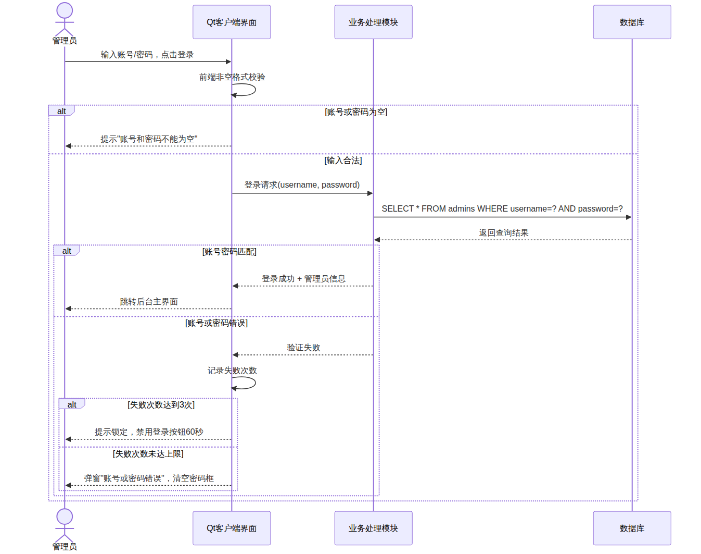

# 需求 #11 — 管理员账号登录

| 属性 | 内容 |
|------|------|
| 所属子系统 | PC 服务器端 |
| 需求类别 | 功能需求 |
| 开发技术 | C++ / Qt Creator / SQLite |

## 功能描述

管理员在 PC 服务器端后台界面输入账号和密码，系统通过查询 `admins` 数据库表对凭证进行验证，决定是否授权进入后台管理主界面。

系统出厂内置初始管理员账号 `admin`、初始密码 `123456`。验证流程：前端完成基础格式校验后，将账号和密码发送至业务处理模块；业务处理模块查询管理员表，比对 `username` 与 `password` 字段。若匹配成功，返回管理员基本信息并跳转主界面；若匹配失败，返回统一错误提示，**不区分**"账号不存在"与"密码错误"，以防止账号枚举攻击。

## 前置条件

1. 数据库已完成初始化，`admins` 表中存在有效账号记录
2. Qt PC 端应用程序正常启动，SQLite 数据库连接可用

## 输入

1. 管理员账号（字符串，不超过 32 位）
2. 管理员密码（字符串，不超过 32 位）

## 输出

1. 登录成功：跳转后台主界面，顶栏显示当前账号
2. 登录失败：弹窗错误提示，密码框清空并重新获焦

## 异常情况处理

| 异常场景 | 处理方式 |
|----------|----------|
| 账号或密码为空 | 前端直接拦截，不发起数据库查询，提示"账号和密码不能为空" |
| 账号或密码错误 | 弹窗"账号或密码错误，请重新输入"，清空密码框，焦点重置至密码框 |
| 连续登录失败 3 次 | 提示"登录失败次数过多，请 60 秒后重试"，登录按钮禁用并倒计时 |
| 数据库连接失败 | 捕获 SQL 异常，提示"系统异常，无法连接数据库，请联系技术支持"，禁止进入主界面 |

## UML 时序图

### 时序图参与者说明

| 参与者 | 说明 |
|--------|------|
| 管理员 | 操作 PC 服务器端后台的人员 |
| Qt客户端界面 | PC 服务器端的 Qt 图形界面层，负责用户交互与输入校验 |
| 业务处理模块 | 核心逻辑层，处理登录验证逻辑与失败计数 |
| 数据库 | SQLite 数据库，存储管理员账号与密码 |
